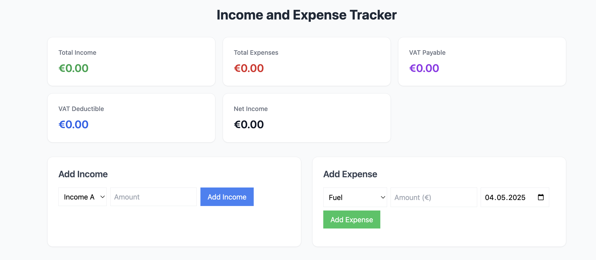

# A Simple Book Keeping project

Built by using `'TypeScript'` and `'Tailwind CSS'`. The project calculates income and expenses with VAT deductible and VAT payable.


## Clone

```bash
git clone https://github.com/nahusenayElias/incomeTrackerTypeScript

```


## Install dependencies

```bash
npm install
```

## Run server in the localhost:


```bash
npm run dev
```


 


 Elias Hagos ™